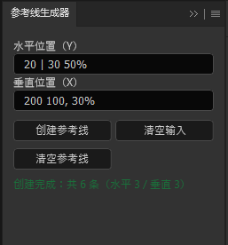

## NG_PS_UXP_Extension
这是一个个人的 ps uxp 扩展

## 如何使用

1. 下载项目
2. 将项目复制到 ``` C:\Users\{你的用户名}\AppData\Roaming\Adobe\UXP\Plugins\External ``` 中，缺少相关文件时手动创建
3. 重启 ps

## 功能

### 参考线生成器



- 支持百分比
- 分隔符支持空格、```,```、```|```、```;```
